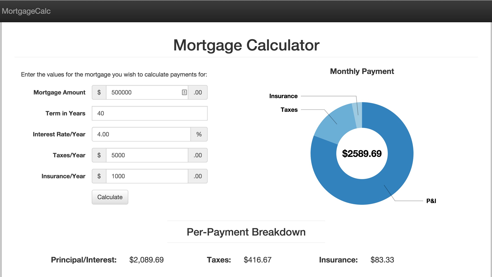
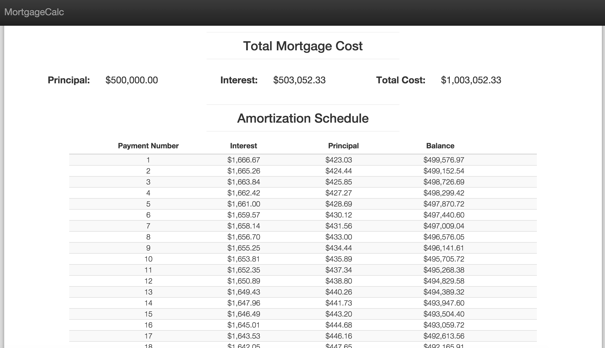

# Mortgage Calc

This application is a simple mortgage calculator allowing a user to input their mortgage parameters
and obtain a monthly payment breakdown, total cost of loan and amortization schedule.

## Installation and Configuration

In order to use this calculator, you can download/clone the repository to a location on your local
computer and then open the "index.html" file in a browser of your choice (Google Chrome works
well).

## Disclaimer

This application is a best-effort attempt to calculate costs associated with a typical/conventional mortgage.
It should in no way be entirely depended upon and the developer makes no guarantee as to the level of accuracy
of the numbers calculated. Usage of this tool implies that the user is relieving the developer of all misfortunes
or issues related to or as a result of the data provided within the tool.

## Screenshots

